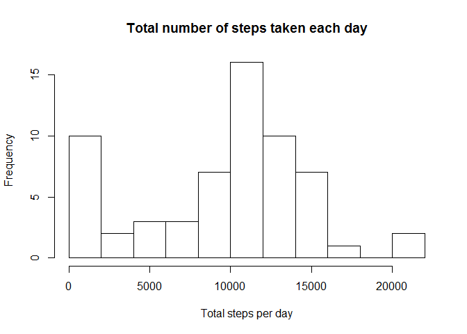
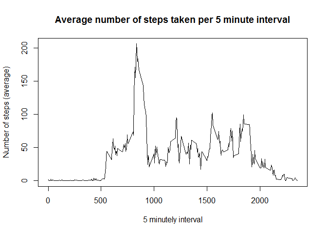
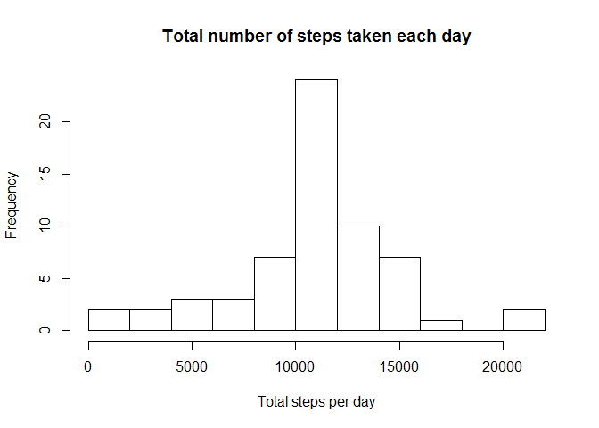

# Reproducible Research: Peer Assessment 1

# Introduction
This report aims to analysis the activity data provided by activity monitoring devices such as a Fitbit to find out if the activity pattern changes on a weekend from a week day.
 

## Prerequisites

The report is written in R Markdown utilizing the Lattice and dplyr packages. The versions are displayed below.


```r
library(lattice)
library(dplyr)
```

```
## 
## Attaching package: 'dplyr'
## 
## The following object is masked from 'package:stats':
## 
##     filter
## 
## The following objects are masked from 'package:base':
## 
##     intersect, setdiff, setequal, union
```

```r
sessionInfo()
```

```
## R version 3.1.3 (2015-03-09)
## Platform: x86_64-w64-mingw32/x64 (64-bit)
## Running under: Windows 7 x64 (build 7601) Service Pack 1
## 
## locale:
## [1] LC_COLLATE=English_United Kingdom.1252 
## [2] LC_CTYPE=English_United Kingdom.1252   
## [3] LC_MONETARY=English_United Kingdom.1252
## [4] LC_NUMERIC=C                           
## [5] LC_TIME=English_United Kingdom.1252    
## 
## attached base packages:
## [1] stats     graphics  grDevices utils     datasets  methods   base     
## 
## other attached packages:
## [1] dplyr_0.4.1     lattice_0.20-31
## 
## loaded via a namespace (and not attached):
##  [1] assertthat_0.1  DBI_0.3.1       digest_0.6.8    evaluate_0.7   
##  [5] grid_3.1.3      htmltools_0.2.6 knitr_1.10.5    magrittr_1.5   
##  [9] parallel_3.1.3  Rcpp_0.11.6     rmarkdown_0.6.1 stringi_0.4-1  
## [13] stringr_1.0.0   tools_3.1.3     yaml_2.1.13
```

# Data
The data is included with the github repository in the file `activity.zip`. The variables included in this dataset are:

 * steps: Number of steps taking in a 5-minute interval (missing values are coded as NA)
 * date: The date on which the measurement was taken in YYYY-MM-DD format
 * interval: Identifier for the 5-minute interval in which measurement was taken

The dataset is stored in a comma-separated-value (CSV) file and there are a total of 17,568 observations in this dataset.


```r
activities <- read.csv(unz("activity.zip", "activity.csv"), colClass=c("numeric", "Date" , "numeric"))
```

A summary of the data:

```r
str(activities)
```

```
## 'data.frame':	17568 obs. of  3 variables:
##  $ steps   : num  NA NA NA NA NA NA NA NA NA NA ...
##  $ date    : Date, format: "2012-10-01" "2012-10-01" ...
##  $ interval: num  0 5 10 15 20 25 30 35 40 45 ...
```

# Analysis

## What is mean total number of steps taken per day?
<b>Calculate the total number of steps taken per day</b>

```r
daily_step_count <- aggregate(activities$steps, list(activities$date), sum, na.rm=TRUE)
names(daily_step_count)[1] <- "date"
names(daily_step_count)[2] <- "count"
```


<b>Make a histogram of the total number of steps taken each day</b>


```r
hist(daily_step_count$count, xlab="Total steps per day", main="Total number of steps taken each day", breaks=10)
```

 

<b>Calculate and report the mean and median of the total number of steps taken per day</b>


```r
mean_daily_steps_taken <- mean(daily_step_count$count)
median_daily_steps_taken <- median(daily_step_count$count)
```

The mean number of steps taken each day is 9354.23 and the median number of steps taken each day is 10395.


## What is the average daily activity pattern?
<b> Make a time series plot (i.e. type = "l") of the 5-minute interval (x-axis) and the average number of steps taken, averaged across all days (y-axis)</b>

```r
fively_minute_step_mean <- aggregate(activities$steps, list(activities$interval), mean, na.rm=TRUE)
names(fively_minute_step_mean)[1] <- "interval"
names(fively_minute_step_mean)[2] <- "mean_steps"
plot(fively_minute_step_mean$interval, fively_minute_step_mean$mean_steps, type = "l", 
     xlab="5 minutely interval", ylab="Number of steps (average)", main="Average number of steps taken per 5 minute interval")
```

 

<b>Which 5-minute interval, on average across all the days in the dataset, contains the maximum number of steps?</b>


```r
max_number_of_step <- max(fively_minute_step_mean$mean_steps)
time_with_max_number_of_steps <- fively_minute_step_mean[fively_minute_step_mean$mean_steps == max_number_of_step,]
hours <- floor(time_with_max_number_of_steps$interval / 60)
minutes <- ((time_with_max_number_of_steps$interval / 60) - hours) * 60
```

The time period with the most number of steps is 835 with 206.1698 steps. This five minute interval starts at 13:55.

## Imputing missing values

<b>Calculate and report the total number of missing values in the dataset (i.e. the total number of rows with NAs</b>


```r
number_of_missing_step_values <- nrow(activities[is.na(activities$steps),])
```

The dataset contains 2304 missing step values. 

<b>Devise a strategy for filling in all of the missing values in the dataset. The strategy does not need to be sophisticated. For example, you could use the mean/median for that day, or the mean for that 5-minute interval, etc.</b>

I'll be populating the missing values with the mean for the 5-minute interval. 


<b>Create a new dataset that is equal to the original dataset but with the missing data filled in.</b>

This works by merging the activities with the five minutely mean to provide every row with a default row for that day. Then mutating that to use the default when no step exists.

```r
activities_with_default <- merge(activities, fively_minute_step_mean)
activities_with_guessed_nas <- select(mutate(activities_with_default, steps =  ifelse(is.na(steps), mean_steps, steps)),
                                      interval, date, steps)
```

<b>Make a histogram of the total number of steps taken each day </b>


```r
daily_step_count_no_nas <- aggregate(activities_with_guessed_nas$steps, list(activities_with_guessed_nas$date), sum)
names(daily_step_count_no_nas)[1] <- "date"
names(daily_step_count_no_nas)[2] <- "count"

hist(daily_step_count_no_nas$count, xlab="Total steps per day", main="Total number of steps taken each day", breaks=10)
```

 

<b>Calculate and report the mean and median of the total number of steps taken per day</b>


```r
mean_daily_steps_taken_no_nas <- mean(daily_step_count_no_nas$count)
median_daily_steps_taken_no_nas <- median(daily_step_count_no_nas$count)
```

The mean number of steps taken each day is 10766.19 
and the median number of steps taken each day is 10766.19.


Mean and median values are higher after imputing missing data. 

## Are there differences in activity patterns between weekdays and weekends?

<b>Create a new factor variable in the dataset with two levels – “weekday” and “weekend” indicating whether a given date is a weekday or weekend day.</b>


```r
activities_with_guessed_nas$weekday = 1
activities_with_guessed_nas$weekday[grep("Sun|Sat", weekdays(activities_with_guessed_nas$date, abbreviate=T))] = 2
activities_with_guessed_nas$weekday = factor(activities_with_guessed_nas$weekday, labels = c("Weekday", "Weekend"))
```

<b>Make a panel plot containing a time series plot (i.e. type = "l") of the 5-minute interval (x-axis) and the average number of steps taken, averaged across all weekday days or weekend days (y-axis).</b>

```r
fively_minute_step_mean <- aggregate(activities_with_guessed_nas$steps, list(activities_with_guessed_nas$weekday, activities_with_guessed_nas$interval), mean, na.rm=TRUE)
names(fively_minute_step_mean)[1] <- "Weekday"
names(fively_minute_step_mean)[2] <- "Interval"
names(fively_minute_step_mean)[3] <- "Steps"

xyplot(Steps ~ Interval | Weekday, data = fively_minute_step_mean, layout = c(1,2), type = "l", ylab="Number of steps")
```

 
